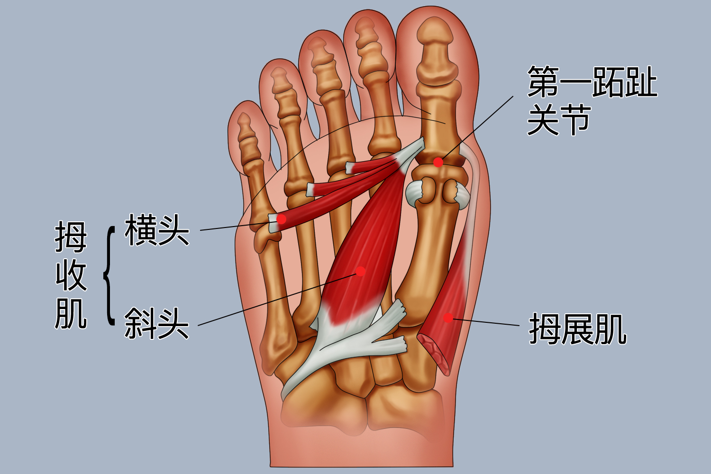
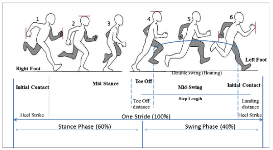
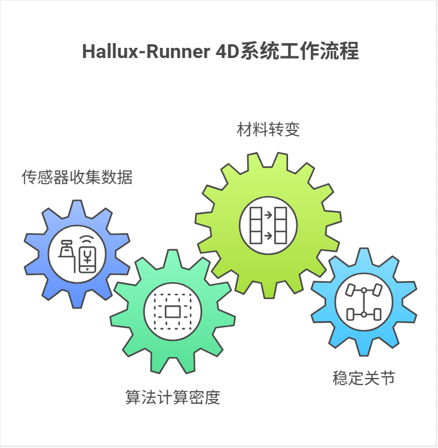
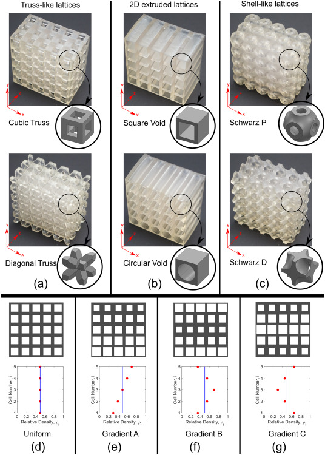
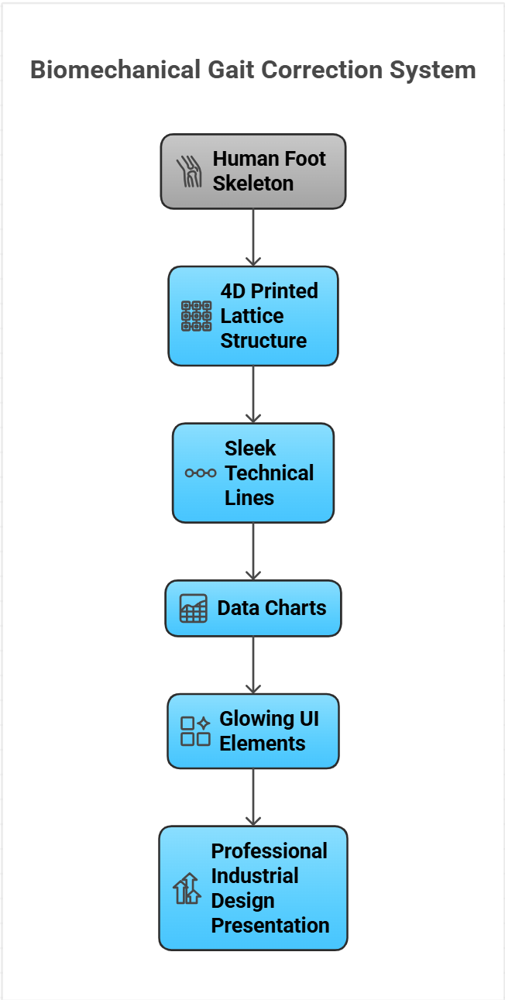

# 🦶 Hallux-Runner 4D: 动态步态纠偏与瞬时力矩重构系统

<video src="全景视频.mp4" width="100%" autoplay loop muted playsinline></video>

<i>A Time-Responsive Forefoot Orthotic System: Rebuilding propulsion at the moment it matters most.</i>

# 01 | 逻辑起点：推进期失效 (Propulsion Failure)
在跑步步态研究中，拇外翻（Hallux Valgus）人群的核心痛点在于离地瞬间的力学补偿缺失。

<i>人体足部解剖逻辑：聚焦第一跖趾关节与动力肌群</i>

⚠️ 运动损伤链分析：

结构失稳：第一跖趾关节无法形成刚性杠杆，导致动力流失。

压力逃逸：负荷被迫向外侧跖骨迁移，造成代偿性损伤。

设计干预：在推蹬的 50-100ms 内，通过支架瞬时重建内侧动力链。

<i>步态周期分析：重点捕捉离地瞬间（Toe-off）的力学干预点</i>

# 02 | 核心方案：4D 响应式结构
Hallux-Runner 4D 利用智能材料的相变特性，实现“按需支撑”。

<video src="4d姿态变化.mp4" width="100%" autoplay loop muted playsinline></video>

<i>4D 相变演示：从柔性避震到刚性支撑的瞬时切换逻辑</i>

4D 打印 SMP (形状记忆聚合物)：通过跑步时的物理能量（热量/冲击）触发，实现材料模量的秒级切换。

拓扑优化晶格 (Lattice Optimization)：通过参数化建模，在保证强度的前提下实现极致轻量化。

# 03 | 交互逻辑：数据驱动的设计 (Parametric Code)
利用代码逻辑驱动几何生成，确保支架密度的精确分布。

<i>Hallux-Runner 4D 系统工作流逻辑图</i>

💻 核心逻辑演示 (Python Interface)
参见仓库中py文件
# 04 | 材料与体验设计：平衡功能与舒适
在工业设计维度，本项目深入探讨了从实验室到日常佩戴的落地可能性。

<i>不同晶格形态（Truss-like / Shell-like）对力学性能的影响实验</i>

生物相容性 (Biocompatibility)：选用医疗级 TPU/SMP 复合材料，确保长期贴肤佩戴不产生过敏或炎症反应。

触觉舒适度 (Tactile Comfort)：针对“硌脚”问题，内侧接触层采用变密度梯度设计（Gradient C）。

柔性缓冲区：接触皮肤层采用低密度晶格，提供类似硅胶的触感。

刚性核心层：内部采用高密度桁架，确保结构强度。

性价比与可维护性 (Cost-Effectiveness)：

采用 FDM 梯度增材制造，大幅降低定制化生产成本。

开放式架构设计，便于汗液排出及日常清洗。

# 05 | 制造原型：参数化晶格对比
通过对 VOR、TET-H 等多种晶格单元的分析，最终选定最优力学结构。

<i>不同制造工艺（TPU vs LW-PLA）下的晶体单元一致性测试</i>

# 06 | 模拟验证：力线重构演示

<video src="跑动时的视频.mp4" width="100%" autoplay loop muted playsinline></video>

<i>X-Ray 透视仿真：支架激活后的内侧动力链重建效果</i>

<i>系统架构概览：从生物骨骼到专业设计呈现</i>

Hallux-Runner 4D | Project by Dong Zhuoran
Redefining Human Performance through Structural Logic.
